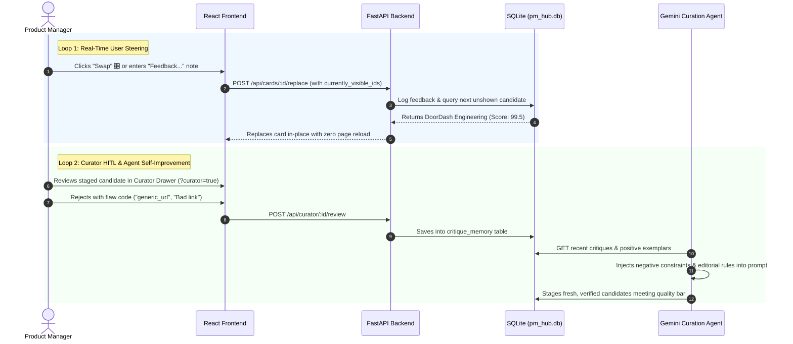

# PM Learning Hub — AI Deep Dive, Product Sense & Strategy 🧠

> **An executive intelligence platform and continuous learning companion for Product Managers, Staff/Principal PMs, and AI Product Leaders.**

[](https://pm-learning-hub-595396735241.us-central1.run.app)
[](https://www.python.org/)
[](https://fastapi.tiangolo.com)
[](https://vitejs.dev/)
[](https://ai.google.dev/)
[](#security-privacy--zero-secrets-guarantee)

> 🚀 **Live Production URL**: [https://pm-learning-hub-595396735241.us-central1.run.app](https://pm-learning-hub-595396735241.us-central1.run.app)  
> 🛠️ **Curator Review Mode**: [https://pm-learning-hub-595396735241.us-central1.run.app/?curator=true](https://pm-learning-hub-595396735241.us-central1.run.app/?curator=true)  
> 📄 **GitHub Pages Mirror**: [https://chugh-gourav.github.io/AI-Prototyping/](https://chugh-gourav.github.io/AI-Prototyping/)

---

## 1. Executive Summary & Product Vision

### The Product Problem
As AI advances rapidly from prompt engineering to compound reasoning systems and autonomous agent workflows, product leaders face severe signal-to-noise friction:
- **Surface-Level Marketing Fluff**: The internet is inundated with generic consumer chatbot wrappers and speculative thought-pieces lacking production engineering rigor.
- **Missing Technical Grounding**: PMs need to understand real-world architectural trade-offs (e.g. KV-cache compaction, TTFT vs. ITL latency SLAs, multi-model consensus juries, prompt caching) to define feasible roadmaps.
- **Unit Economics Disconnect**: AI features frequently fail at scale because PMs lack concrete financial models for token COGS, GPU amortization curves, and gross margin protection.
- **Link Rot & Generic Homepages**: Traditional aggregators frequently link to generic blog roots (e.g. `netflixtechblog.com/`) rather than verified, specific practitioner deep dives.

### The Solution: PM Learning Hub
The **PM Learning Hub** is an autonomous, editorial-grade intelligence hub designed to give product leaders a high-leverage competitive edge:
1. **Verified 2025/2026 Practitioner Sources**: Sourced strictly from Tier-1 research labs (DeepMind, Anthropic, OpenAI) and battle-tested engineering teams (Netflix, Stripe, DoorDash, Uber, Databricks).
2. **Executive Flowing Summaries**: Articles are synthesized into concise, high-density narrative prose connecting the technical problem, the shipped architecture, and the strategic "So What" for Senior/Staff PMs.
3. **Cross-Pillar Meta-Thinking ("Connect the Dots")**: Synthesizes how Technical Architecture ⟷ Unit Economics ⟷ Product Roadmap interconnect for every piece.
4. **Dual-Tier Closed-Loop Feedback**:
   - **Real-Time User Steering**: Instant card micro-swaps, upvotes, and custom steer notes immediately re-rank the live feed.
   - **Editorial Critique Memory**: Rejections and editorial refinements are recorded into SQLite to steer future autonomous agent discovery runs.
5. **Human-in-the-Loop (HITL) Curator Mode**: Pre-staged candidate queue with "Fetch Content and Review", grammar polishing, and 1-click live database publishing.

---

## 2. The 4 Strategic Learning Pillars

| Pillar | Focus Area | Example Topics & Practitioner Case Studies |
| :--- | :--- | :--- |
| **1. AI Deep Dive & Application** | Technical architectures, reasoning models, agentic workflows, production evals | Contextual retrieval, hybrid test-time reasoning (Anthropic), multimodal video search (Netflix), multi-model LLM juries (DoorDash). |
| **2. Business & Economics** | AI unit economics, pricing models, gross margin defense, enterprise adoption | Token COGS modeling, defending 70%+ SaaS margins, open vs. closed model TCO (a16z), enterprise agent economics (Klarna & OpenAI). |
| **3. Core Product Management** | Product sense, human discernment, executive decision frameworks in the AI era | Human judgment when execution is automated (Shreyas Doshi), empirical AI developer tooling evals (Thoughtworks), Canvas co-creation UX (OpenAI). |
| **4. Product Ideas to try** | Actionable product interaction design patterns, GUI automation, and prototyping patterns | People + AI Guidebook UX heuristics (Google PAIR), Computer Use agent workflows (Anthropic), production LLM patterns (Eugene Yan). |

---

## 3. Dynamic 4-Tier Credibility Ranking Model

Every article ingested into the platform is dynamically scored on a **100-point scale**:

$$\text{Total Score} = \text{Tier Score (25)} + \text{Recency (25)} + \text{Base Relevance (25)} + \text{Feedback Alignment (25)}$$

```mermaid
graph LR
    subgraph Credibility Score (0-25)
        T1[Tier 1: Research Labs & Engineering Blogs - 1.00]
        T2[Tier 2: Premier Strategy, VCs & GSBs - 0.85]
        T3[Tier 3: Proven Practitioners & Newsletters - 0.70]
        T4[Tier 4: General Tech Media - 0.30]
    end
    
    subgraph Recency Score (0-25)
        R1[< 4 Months: 25.0 pts]
        R2[4-8 Months: 20.0 pts]
        R3[8-12 Months: 12.0 pts]
        R4[Timeless Classic: 5.0 pts]
    end
    
    subgraph Feedback Score (0-25)
        F1[Neutral Baseline: 15.0 pts]
        F2[Boosted Topic / User Prompt: +10.0 pts]
        F3[Penalized / Swapped Topic: -8.0 pts]
    end
```

---

## 4. End-to-End Closed-Loop Feedback System

The platform implements **two active feedback loops**:



---

## 5. Repository File Map (PM & Engineering Guide)

```
PM-AI-Agent/
│
├── 🧠 BACKEND (FastAPI & SQLite Engine)
│   ├── backend/
│   │   ├── api_server.py               # REST API: recommendations, card swaps, feedback, curator endpoints
│   │   ├── db.py                       # SQLite schema, 100-pt ranking algorithm, critique memory
│   │   ├── pm_hub.db                   # Embedded SQLite database (generated on seed, ignored in git)
│   │   ├── seed_data.py                # 20+ verified practitioner articles with complete PM metadata
│   │   ├── verify_catalog_integrity.py # Tier 1 deterministic gate (HTTP 200, deep links, authentic dates)
│   │   ├── eval_recommendations.py     # Automated quality audit script
│   │   └── eval_report.json            # Quality audit results
│   │
├── 🎨 FRONTEND (React + Vite Web Application)
│   ├── frontend/
│   │   ├── src/
│   │   │   ├── App.jsx                 # Single-page app: hero spotlight, 2x2 grid, PRD modal, Curator Drawer
│   │   │   ├── index.css               # Design system: Skyscanner Midnight Navy & Sky Blue palette
│   │   │   └── main.jsx                # React bootstrapping
│   │   ├── public/                     # Static assets and fallback data
│   │   ├── package.json                # Dependencies: React 19, Lucide React, Vite
│   │   └── vite.config.js              # Vite configuration (Port 5173)
│   │
├── 🤖 AGENT (Autonomous Discovery & Google ADK)
│   ├── agent/
│   │   ├── agent.py                    # Root Google ADK agent with specialized PM tools
│   │   ├── .env.example                # Safe environment variable template (No secrets)
│   │   ├── tools/
│   │   │   ├── curate_reading.py       # Domain allowlist and reading list curation
│   │   │   ├── exercises.py            # Hands-on prompt & architectural exercises
│   │   │   ├── applied_cases.py        # Case studies (Netflix, Stripe, Databricks)
│   │   │   ├── business.py             # Token economics & gross margin calculators
│   │   │   └── weekly_plan.py          # 5-day personalized PM learning sprints
│   │   └── prompts/
│   │       └── system_prompt.py        # System prompt with 4-tier credibility matrix & PM persona
│   │
└── 🚀 DEPLOYMENT & DEVOPS
    ├── Dockerfile                      # Production container spec for Google Cloud Run
    ├── requirements.txt                # Python dependencies
    ├── .gitignore                      # Strict exclusion rules (No secrets, no node_modules, no DBs)
    └── README.md                       # Product documentation (this file)
```

---

## 6. Security, Privacy & Zero-Secrets Guarantee

- **Zero Secrets in Code**: No API keys, credentials, or private tokens are committed to this repository.
- **Environment Driven**: All model endpoints read keys from system environment variables (`GOOGLE_API_KEY` or `GEMINI_API_KEY`).
- **Anonymous Feedback**: All user telemetry, feedback ratings, and steer notes stored in SQLite are strictly anonymous with **Zero PII** (Personally Identifiable Information).
- **Safe Fallbacks**: The system gracefully falls back to deterministic rule-based grammar checking and verified local candidate pools if no API key is supplied.

---

## 7. Quickstart Guide (Local Setup in 3 Minutes)

### Prerequisites
- **Python**: 3.10 or higher
- **Node.js**: 18.0 or higher (`npm`)

### Step 1: Clone Repository & Setup Environment
```bash
git clone https://github.com/Chugh-Gourav/AI-Prototyping.git
cd AI-Prototyping/PM-AI-Agent
```

### Step 2: Configure Environment (Optional for Live Gemini Discovery)
```bash
cp agent/.env.example .env
# Open .env and add your GEMINI_API_KEY from Google AI Studio (https://aistudio.google.com/apikey)
```

### Step 3: Initialize the Backend & Seed Database
```bash
# Install Python dependencies
pip install -r requirements.txt

# Seed the master catalog of verified practitioner articles
python3 backend/seed_data.py

# Launch the FastAPI server (Port 8000)
python3 -m uvicorn backend.api_server:app --reload --port 8000
```

### Step 4: Launch the Frontend
In a separate terminal:
```bash
cd frontend
npm install
npm run dev
```
Open **[http://localhost:5173](http://localhost:5173)** in your browser.

---

## 8. Special User & Curator Modes

### 1. Reader / Executive Mode
Navigate to **`http://localhost:5173`**:
- Read executive flowing summaries with embedded problem, shipped architecture, and strategic takeaway.
- Dive into **Cross-Pillar Meta-Thinking ("Connect the Dots")** linking technical mechanics, unit economics, and product strategy.
- Explore **Product Ideas to try** with human-centered AI heuristics (Google PAIR) and desktop automation patterns (Anthropic Computer Use).
- Use **`Signal` (👍)**, **`Applied` (✓)**, and **`Swap` (🎛)** to steer the live feed in real time.
- Filter by pillar, search full-text articles, bookmark favorites, and export customized reading lists.

### 2. Curator Review Drawer (HITL Mode)
Navigate to **`http://localhost:5173/?curator=true`**:
- Opens the slide-over **Curator Review Drawer** with pre-staged candidate articles ready for evaluation.
- Click **`Fetch Content and Review`** to trigger autonomous Gemini discovery, URL integrity verification, and pre-scoring.
- Click **`✨ Check Grammar & Polish`** to run automated grammar checks and executive phrasing optimization.
- Click **`Approve Live`** or **`Edit & Publish`** to instantly commit the approved article into the production SQLite database and promote it into the live feed.
- **Reject** unsuitable candidates with flaw classification to train the agent's critique memory.

---

## 9. Evaluation & Quality Gates

The catalog is guarded by an automated quality evaluation suite:
```bash
python3 backend/eval_recommendations.py
```

The test harness evaluates the catalog across 5 strict criteria:
1. **Tier Credibility (25 pts)**: Ensures content comes from approved research labs, VCs, and verified practitioners.
2. **Link Integrity & Authenticity (25 pts)**: Verifies direct deep links and flags generic root URLs.
3. **PM Actionability & "So What" (20 pts)**: Audits executive summaries and measurable takeaways.
4. **2025/2026 Recency Gate (20 pts)**: Penalizes outdated content while respecting explicitly flagged timeless classics.
5. **Feedback Loop Health (10 pts)**: Confirms seamless integration with SQLite feedback and critique memory tables.

---

## 10. Deployment to Production

### Containerized Deployment (Google Cloud Run / AWS ECS)
A production multi-stage Docker build is included:
```bash
# Build Docker image
docker build -t pm-learning-hub .

# Run container locally
docker run -p 8080:8080 -e PORT=8080 pm-learning-hub
```

Deploy directly to Google Cloud Run:
```bash
gcloud run deploy pm-learning-hub \
  --source . \
  --platform managed \
  --region us-central1 \
  --allow-unauthenticated
```
